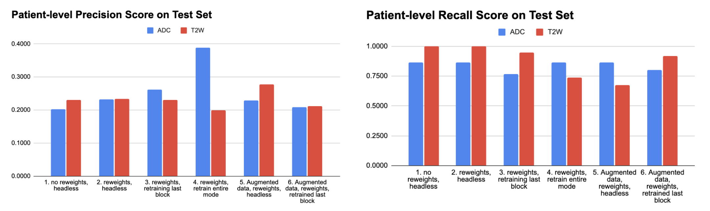
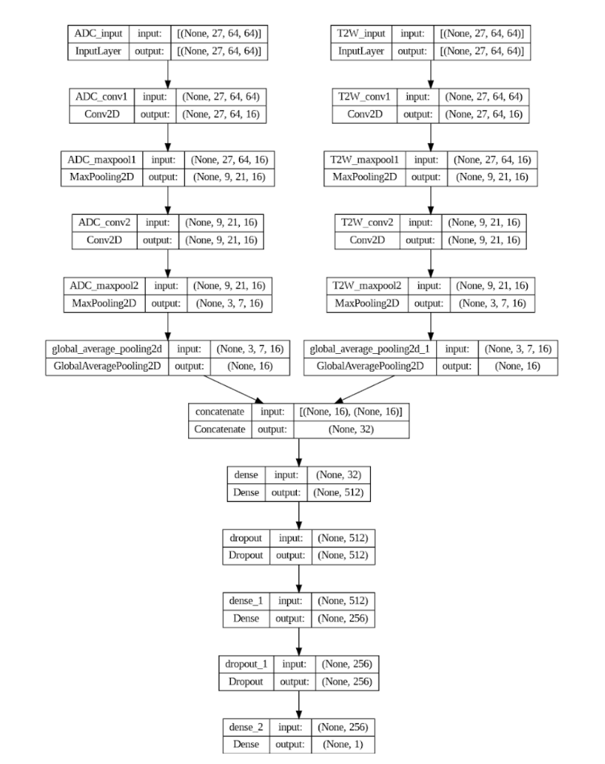

# Computer Vision Project
MIT 6.8300 Advances in Computer Vision

## Problem Statement
Prostate cancer presents challenges in its diagnosis using prostate biparametric Magnetic Resonance Imaging (MRI). The reliance on multiple imaging modalities, such as ADC and T2W, coupled with the heterogeneous nature of the disease, results in low inter-reader agreement (less than 50%) and sub-optimal interpretation (Westphalen et al., 2020). Past studies have explored 3D imaging and multi-modal approaches to enhance interpretation, often by reformulating the problem into a 2D context through lesion centre slicing (Liu et al., 2017). However, these methods require lesion location identification, which is complex and poses limitations. This project aims to address this limitation by investigating the possibility of cancer detection without prior knowledge of the lesion location. Additionally, we seek to explore the feasibility of utilising a single imaging modality for detecting clinically significant prostate cancer, thereby streamlining the decision-making process.

## Methodology and Approach
A data pre-processing step has been defined in the report. For each patient, we are given their ADC input image and T2W input image along with a radiologist annotated image of where the cancer region is. After preprocessing, we fine-tuned a pre-trained VGG19 model and experimented with the following:

- Data augmentation: To increase training samples as number of parameters was significantly greater than number of input images
- Reweighting classes: To handle the class imbalance
- Retraining: Either keep ImageNet weights, retrain just the last block of VGG19, or retrain the entire VGG19 model

The results from above were then compared against a simple convolutional neural network (CNN) architecture that takes both ADC and T2W images as inputs to emulate a doctor’s decision making process (i.e., we wanted to compare a single image modality vs. a two image modality model), which forms the baseline model (See page 3 for architecture)

## Results and Discussion

These were the key findings:
- **Low precision, high recall**: Model is struggling to distinguish between cancer and non-cancer cases. The learned decision boundary was not well-defined. Likely explanations include severity of the class imbalance, such that reweighting alone was insufficient, or the model’s inability to learn features from the input images to distinguish between the two classes.
  
- **Data augmentation didn’t help**: Medical imaging often contains very specific features of interest for diagnosis. These would be the very localised and small cancerous regions within the prostate, as shown by the annotated images, which are often not invariant to transformations like flips, rotations, or zooms.

- **T2W fine-tuned on the last block outperformed full fine-tune. Reverse for ADC**: T2W images, rich in spatial detail and contrast, need fewer parameters for feature learning, making last-block fine-tuning effective and full model fine-tuning prone to overfitting. In contrast, ADC images, with less spatial detail and contrast, necessitate more extensive fine-tuning to capture relevant features, explaining why full model fine-tuning outperformed in this case.

- **Roughly similar performances seen with the baseline**: In earlier models, feature extraction needed to be performed on a single modality, and the model needed to learn all relevant features from that single source. In the two-branch model, the burden of feature extraction is shared across two different modalities, which might make the task easier, hence resulting in comparable testing performances.

## Conclusions
No real gains in performance between ADC or T2W. Both imaging modalities are evidently needed to make a reliable decision. This was reflected by the earlier model performances vs. the simple CNN baseline. Nonetheless, we would have explored further into using UNet and vision transformers that can use two image modalities to enhance predictions given more time and compute resources.

## Report

## Presentation

## Notebooks
There are 9 notebooks. For notebooks prefixed with 01 to 08, the naming format are as follows:
- Prefix 1: Data augmentation techniques (raw or augmented)
- Prefix 2: Reweighting (default or reweighted)
- Prefix 3: Fine-tuning method (default pretrained, fine-tuned last block, or full fine-tune)

Hence, a general notebook naming convention would be: 0X - <Prefix 1> - <Prefix 2> - <Prefix 3>.ipynb 
